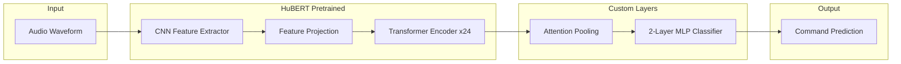

# Dysarthric Voice Command Classifier

A deep learning system for recognizing voice commands from speakers with dysarthria, built on HuBERT with curriculum learning. Achieves ~87% accuracy on dysarthric speech using the TORGO dataset.

## Overview

Dysarthria is a motor speech disorder that affects the muscles used for speaking, making speech difficult to understand. This project provides an accessible voice command interface specifically designed for individuals with dysarthric speech patterns.

**Key Features:**
- 20 voice commands (10 digits + 10 directional/action commands)
- HuBERT-large based architecture with learned attention pooling
- Curriculum learning: pre-train on control speakers, fine-tune on dysarthric speakers
- Gradio web interface for real-time inference (record or upload audio)
- Comprehensive audio augmentation pipeline

## Architecture



The model uses:
- **HuBERT-large** (315M parameters) as the speech encoder
- **Attention pooling** to learn which audio frames are most important for classification
- **2-layer MLP classifier** with GELU activation and dropout

## Development Journey

This project evolved through iterative improvements:

**Initial Attempt (~20% accuracy)**
- HuBERT-large with linear classifier
- Mean pooling over time dimension
- No data augmentation
- All 46 classes (digits + commands + radio alphabet)

**Key Improvements**
1. Replaced mean pooling with **attention pooling** — learns which frames matter most
2. Changed linear classifier to **2-layer MLP** with GELU activation and dropout
3. Added comprehensive **data augmentation** pipeline (noise, pitch shift, time stretch, gain, SpecAugment)
4. Implemented **curriculum learning** (control speakers → dysarthric speakers)

**Scaling Strategy**
- First validated approach with 10 digit classes (zero-nine)
- Once successful, expanded to 20 classes (10 digits + 10 directional/action commands)
- Architecture supports scaling to full 46 classes if needed

## Project Structure

```
dysarthric-voice-cmds/
├── app/
│   └── gradio_app.py          # Web interface for inference
├── src/
│   ├── config.py              # Centralized configuration
│   ├── data/
│   │   ├── preprocessing.py   # TORGO dataset scanning
│   │   ├── dataset.py         # PyTorch Dataset class
│   │   └── augmentation.py    # Audio augmentation pipeline
│   ├── model/
│   │   ├── architecture.py    # HuBERT + classifier model
│   │   └── utils.py           # Model utilities
│   ├── training/
│   │   └── trainer.py         # Training and validation loops
│   └── inference/
│       └── predictor.py       # Inference wrapper class
├── scripts/
│   └── train.py               # 3-phase curriculum learning training script
├── outputs/                   # Trained models and results
├── model_cache/               # Cached HuBERT weights
├── main.ipynb                 # Main training notebook
├── FUTURE_WORK.md             # Future improvement ideas
└── requirements.txt           # Python dependencies
```

## Installation

### 1. Clone the repository

```bash
git clone <repository-url>
cd dysarthric-voice-cmds
```

### 2. Install dependencies

```bash
pip install -r requirements.txt
```

**Requirements:**
- torch, torchaudio
- transformers
- librosa
- scikit-learn
- pandas, matplotlib, seaborn
- audiomentations
- gradio>=4.0.0

### 3. Download the TORGO dataset

Download from: [TORGO Database](http://www.cs.toronto.edu/~complingweb/data/TORGO/torgo.html)

Update the `TORGO_ROOT` path in `src/config.py` to point to your TORGO directory.

### 4. Download HuBERT model

The HuBERT model will be automatically downloaded via ModelScope on first training run. The model is cached in `model_cache/` for subsequent runs.

Alternatively, you can pre-cache it:

```python
from modelscope import snapshot_download

model_dir = snapshot_download("facebook/hubert-large-ls960-ft", cache_dir="model_cache")
```

## Quick Start

### Training the Model

```bash
# Full training (Phase A + B + C with LOSO evaluation)
python scripts/train.py

# Skip LOSO evaluation for faster training
python scripts/train.py --skip-phase-c

# Customize training epochs
python scripts/train.py --epochs-a 10 --epochs-b 10 --epochs-loso 5

# Full options
python scripts/train.py \
    --epochs-a 20 \           # Phase A epochs (control pretraining)
    --epochs-b 20 \           # Phase B epochs (dysarthric fine-tuning)
    --epochs-loso 10 \        # Phase C LOSO fine-tuning epochs per fold
    --batch-size 8 \          # Batch size
    --seed 42 \               # Random seed for reproducibility
    --skip-phase-c            # Skip LOSO evaluation
```

**Output artifacts:**
- `outputs/phase_a_control_pretrained.pt` - Phase A checkpoint
- `outputs/phase_b_curriculum_trained.pt` - Phase B checkpoint (main model)
- `outputs/curriculum_fold{N}_{speaker}.pt` - Per-fold models from Phase C
- `outputs/curriculum_cv_results.csv` - Cross-validation results
- `outputs/curriculum_cv_results.json` - JSON format results
- `outputs/label_mapping.json` - Label encoding

### Running the Web Interface

```bash
python app/gradio_app.py
```

**Command-line options:**
```bash
python app/gradio_app.py \
    --checkpoint outputs/phase_b_curriculum_trained.pt \
    --labels outputs/label_mapping.json \
    --model-cache model_cache/facebook/hubert-large-ls960-ft \
    --port 7860 \
    --share  # Creates a public URL
```

### Inference in Python

```python
from src.inference.predictor import VoiceCommandPredictor

predictor = VoiceCommandPredictor(
    checkpoint_path="outputs/phase_b_curriculum_trained.pt",
    label_mapping_path="outputs/label_mapping.json",
    model_cache_dir="model_cache/facebook/hubert-large-ls960-ft"
)

# From file
result = predictor.predict_file("path/to/audio.wav")

# From numpy array
result = predictor.predict(audio_array, sample_rate=16000)

print(f"Predicted: {result['label']} ({result['confidence']*100:.1f}%)")
```

## Supported Commands

| Category | Commands |
|----------|----------|
| **Digits** | zero, one, two, three, four, five, six, seven, eight, nine |
| **Actions** | yes, no, up, down, left, right, forward, back, select, menu |

## Training Methodology

### Curriculum Learning

The model uses a three-phase curriculum learning approach:

**Phase A: Control Speaker Pre-training**
- Train on non-dysarthric (control) speakers
- Speech patterns closer to HuBERT's original training data
- Establishes strong baseline representations

**Phase B: Dysarthric Fine-tuning**
- Fine-tune on dysarthric speakers only
- Lower learning rate to preserve Phase A knowledge
- Adapts to dysarthric speech patterns

**Phase C: Leave-One-Speaker-Out (LOSO) Evaluation**
- Cross-validation leaving one dysarthric speaker out for testing
- Ensures model generalizes to unseen speakers

### Sub-Phase Training (within each curriculum phase)

Each curriculum phase uses a two-stage training approach:

1. **Warmup Stage**: Train only the classifier head with encoder frozen
2. **Fine-tuning Stage**: Unfreeze top N transformer layers with differential learning rates

**Phase A (Control Pretraining):**
- Warmup: 1/3 of total epochs, classifier only
- Fine-tune: 2/3 of total epochs, top layers unfrozen

**Phase B (Dysarthric Fine-tuning):**
- Full fine-tuning with lower learning rates to preserve Phase A knowledge

### Command-Line Arguments

| Argument | Description | Default |
|----------|-------------|---------|
| `--epochs-a` | Phase A epochs (control pretraining) | from config |
| `--epochs-b` | Phase B epochs (dysarthric fine-tuning) | from config |
| `--epochs-loso` | Phase C LOSO fine-tuning epochs per fold | 10 |
| `--batch-size` | Training batch size | from config |
| `--seed` | Random seed for reproducibility | 42 |
| `--skip-phase-c` | Skip LOSO evaluation | False |

### Hyperparameters

| Parameter | Value |
|-----------|-------|
| Batch size | 8 |
| Control pretraining LR | 1e-4 |
| Control fine-tune LR | 5e-5 |
| Dysarthric LR (classifier) | 5e-5 |
| Dysarthric LR (encoder) | 5e-6 |
| Weight decay | 0.01 |
| Unfrozen encoder layers | 4 (top) |
| Max audio length | 3 seconds |
| Sample rate | 16kHz |
| Class weighting | Enabled (balanced) |

See `src/config.py` for all configurable parameters.

## Dataset: TORGO

The [TORGO database](http://www.cs.toronto.edu/~complingweb/data/TORGO/torgo.html) contains acoustic and articulatory speech data from speakers with dysarthria.

**Speakers:**
- 8 dysarthric speakers (F01, F03, F04, M01-M05)
- 7 control speakers (FC01-FC03, MC01-MC04)

**Microphone Types:**
- `wav_arrayMic`: Acoustic Magic array microphone (recommended, better quality)
- `wav_headMic`: Head-mounted microphone

## Data Augmentation

The training pipeline applies several augmentation techniques to improve robustness:

**Time-domain augmentations** (using audiomentations):
- Gaussian noise injection
- Pitch shifting (±2 semitones)
- Time stretching (0.9x - 1.1x)
- Time shifting (±20%)
- Gain adjustment (±6 dB)

**SpecAugment-style augmentation:**
- Time masking (zeros out random time segments)

All augmentation parameters are configurable in `src/config.py`.

## Model Architecture Details

### HuBERT Encoder

- **Model**: `facebook/hubert-large-ls960-ft`
- **Parameters**: 315M total
- **Architecture**: 24 transformer layers, 1024 hidden size
- **Pre-training**: Self-supervised on LibriSpeech 960h

The CNN feature extractor and feature projection layers are always frozen. During fine-tuning, only the top 4 transformer layers are unfrozen.

### Attention Pooling

Instead of simple mean pooling, the model uses learned attention pooling:

```python
class AttentionPooling(nn.Module):
    def __init__(self, hidden_size):
        self.attention = nn.Sequential(
            nn.Linear(hidden_size, hidden_size // 4),
            nn.Tanh(),
            nn.Linear(hidden_size // 4, 1)
        )
    
    def forward(self, hidden_states):
        attention_weights = softmax(self.attention(hidden_states), dim=1)
        return (hidden_states * attention_weights).sum(dim=1)
```

This allows the model to learn which audio frames are most relevant for classification.

### Classification Head

```python
self.classifier = nn.Sequential(
    nn.Linear(1024, 512),      # hidden_size -> hidden_size/2
    nn.GELU(),
    nn.Dropout(0.1),
    nn.Linear(512, num_labels)  # -> num_classes
)
```

## Results

- **Cross-validation accuracy**: ~87% on dysarthric speakers
- **Evaluation method**: Leave-one-speaker-out (LOSO) cross-validation

Output artifacts in `outputs/`:
- `confusion_matrix.png` - Confusion matrix visualization
- `per_class_accuracy.png` - Per-class accuracy breakdown
- `curriculum_per_speaker_accuracy.png` - Accuracy by speaker
- `curriculum_cv_results.json` - Detailed cross-validation results

## API Reference

### VoiceCommandPredictor

```python
from src.inference.predictor import VoiceCommandPredictor

predictor = VoiceCommandPredictor(
    checkpoint_path: str,      # Path to .pt checkpoint
    label_mapping_path: str,   # Path to label_mapping.json
    model_cache_dir: str,      # Path to cached HuBERT model
    device: str = None         # 'cuda', 'cpu', or auto-detect
)

# Predict from numpy array
result = predictor.predict(audio: np.ndarray, sample_rate: int) -> dict

# Predict from file
result = predictor.predict_file(audio_path: str) -> dict

# Returns: {'label': str, 'confidence': float, 'probabilities': dict}
```

### HuBERTForCommandClassification

```python
from src.model.architecture import HuBERTForCommandClassification

model = HuBERTForCommandClassification(
    model_path: str,           # Path to HuBERT model
    num_labels: int,           # Number of classes
    hidden_size: int = 1024,
    classifier_dropout: float = 0.1,
    freeze_encoder: bool = True,
    freeze_feature_extractor: bool = True
)

# Forward pass
outputs = model(
    input_values: torch.Tensor,           # (batch, seq_len)
    attention_mask: torch.Tensor = None,
    labels: torch.Tensor = None,          # For computing loss
    class_weights: torch.Tensor = None
) -> dict  # {'logits': Tensor, 'loss': Tensor (if labels provided)}

# Unfreeze top N encoder layers for fine-tuning
model.unfreeze_encoder(num_layers=4)
```

### TORGOCommandDataset

```python
from src.data.dataset import TORGOCommandDataset

dataset = TORGOCommandDataset(
    df: pd.DataFrame,          # DataFrame with file_path, label_id columns
    feature_extractor,         # Wav2Vec2FeatureExtractor
    config,                    # Config object
    max_length: int = 48000,   # 3 seconds at 16kHz
    target_sr: int = 16000,
    augment: bool = False      # Enable augmentation for training
)
```

## Future Work

See [FUTURE_WORK.md](FUTURE_WORK.md) for planned improvements:
- Dysarthria detection for adaptive ASR routing
- ESPNet integration for larger-scale ASR

## Acknowledgments

### TORGO Dataset

> Rudzicz, F., Namasivayam, A.K., Wolff, T. (2012) The TORGO database of acoustic and articulatory speech from speakers with dysarthria. *Language Resources and Evaluation*, 46(4), pages 523-541.

### HuBERT

> Hsu, W.N., Bolte, B., Tsai, Y.H.H., Lakhotia, K., Salakhutdinov, R., Mohamed, A. (2021) HuBERT: Self-Supervised Speech Representation Learning by Masked Prediction of Hidden Units. [arXiv:2106.07447](https://arxiv.org/abs/2106.07447)

## License

This project is licensed under the MIT License.
