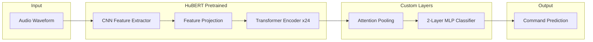

# Dysarthric Voice Command Classifier

A deep learning system for recognizing voice commands from speakers with dysarthria, built on HuBERT with curriculum learning, trained and evaluated on the TORGO dataset.

## Overview

Dysarthria is a motor speech disorder that affects the muscles used for speaking, making speech difficult to understand. This project provides an accessible voice command interface specifically designed for individuals with dysarthric speech patterns.

**Key Features:**
- 20 voice commands (10 digits + 10 directional/action commands)
- HuBERT-large based architecture with learned attention pooling
- Curriculum learning: pre-train on control speakers, fine-tune on dysarthric speakers
- Comprehensive audio augmentation pipeline

## Architecture


```mermaid
flowchart LR
    subgraph input [Input]
        Audio[Audio Waveform]
    end
    subgraph hubert [HuBERT Pretrained]
        FE[CNN Feature Extractor]
        FP[Feature Projection]
        Enc[Transformer Encoder x24]
    end
    subgraph custom [Custom Layers]
        AP[Attention Pooling]
        MLP[2-Layer MLP Classifier]
    end
    subgraph output [Output]
        Pred[Command Prediction]
    end
    Audio --> FE --> FP --> Enc --> AP --> MLP --> Pred
```

The model uses:
- **HuBERT-large** (315M parameters) as the speech encoder
- **Attention pooling** to learn which audio frames are most important for classification
- **2-layer MLP classifier** with GELU activation and dropout

## Development Journey

This project evolved through iterative improvements:

**Initial Attempt (~20% accuracy)**
- HuBERT-large with linear classifier
- Mean pooling over time dimension
- No data augmentation
- All 46 classes (digits + commands + radio alphabet)

**Key Improvements**
1. Replaced mean pooling with **attention pooling** — learns which frames matter most
2. Changed linear classifier to **2-layer MLP** with GELU activation and dropout
3. Added comprehensive **data augmentation** pipeline (noise, pitch shift, time stretch, gain, SpecAugment)
4. Implemented **curriculum learning** (control speakers → dysarthric speakers)

**Scaling Strategy**
- First validated approach with 10 digit classes (zero-nine)
- Once successful, expanded to 20 classes (10 digits + 10 directional/action commands)
- Architecture supports scaling to full 46 classes if needed

## Project Structure

```
dysarthric-voice-cmds/
├── src/
│   ├── config.py              # Centralized configuration
│   ├── data/
│   │   ├── preprocessing.py   # TORGO dataset scanning
│   │   ├── dataset.py         # PyTorch Dataset class
│   │   └── augmentation.py    # Audio augmentation pipeline
│   ├── model/
│   │   ├── architecture.py    # HuBERT + classifier model
│   │   └── utils.py           # Model utilities
│   └── training/
│       └── trainer.py         # Training and validation loops
├── scripts/
│   └── train.py               # 3-phase curriculum learning training script
├── data/                      # Gitignored except README: datasets and caches
│   ├── raw/TORGO/             # TORGO as downloaded
│   └── cache/pretrained/      # Cached HuBERT weights
├── runs/                      # Gitignored: training checkpoints
├── outputs/                   # Results tables and plots
└── requirements.txt           # Python dependencies
```

## Installation

### 1. Clone the repository

```bash
git clone <repository-url>
cd dysarthric-voice-cmds
```

### 2. Install dependencies

```bash
pip install -r requirements.txt
```

For development (adds pytest), install `requirements-dev.txt` instead and run the tests with `python -m pytest tests`.

**Requirements:**
- torch, torchaudio
- transformers
- librosa
- scikit-learn
- pandas, matplotlib, seaborn

### 3. Download the TORGO dataset

```bash
bash scripts/download_torgo.sh
```

This fetches the four archives from the [TORGO Database](http://www.cs.toronto.edu/~complingweb/data/TORGO/torgo.html) and extracts them into `data/raw/TORGO/`. See [data/README.md](data/README.md) for the layout.

### 4. Download HuBERT model

The HuBERT model will be automatically downloaded via ModelScope on first training run. The model is cached in `data/cache/pretrained/` for subsequent runs.

Alternatively, you can pre-cache it:

```python
from modelscope import snapshot_download

model_dir = snapshot_download("facebook/hubert-large-ls960-ft", cache_dir="data/cache/pretrained")
```

## Quick Start

### Training the Model

```bash
# Full training (Phase A + B + C with LOSO evaluation)
python scripts/train.py

# Skip LOSO evaluation for faster training
python scripts/train.py --skip-phase-c

# Customize training epochs
python scripts/train.py --epochs-a 10 --epochs-b 10

# Full options
python scripts/train.py \
    --epochs-a 20 \           # Phase A epochs (control pretraining)
    --epochs-b 20 \           # Phase B epochs (dysarthric fine-tuning)
    --batch-size 8 \          # Batch size
    --seed 42 \               # Random seed for reproducibility
    --skip-phase-c            # Skip LOSO evaluation
```

Run it once per seed (`--seed 0`, `--seed 1`, `--seed 2`); results are reported over at least 3 seeds.

**Output artifacts** (each seed has its own `runs/hubert-large/seed{K}/`, so seeds never overwrite each other):
- `runs/hubert-large/seed{K}/phase_a_control_pretrained.pt` - Phase A checkpoint
- `runs/hubert-large/seed{K}/phase_b_curriculum_trained.pt` - Phase B checkpoint (main model)
- `runs/hubert-large/seed{K}/curriculum_fold{N}_{speaker}.pt` - Per-fold models from Phase C (never trained on `{speaker}`)
- `runs/hubert-large/seed{K}/eval/` - Phase C predictions for the evaluation harness (`src.eval.io.load_run`)
- `outputs/curriculum_cv_results.csv` - Cross-validation results (last seed run)
- `outputs/curriculum_cv_results.json` - JSON format results
- `outputs/label_mapping.json` - Label encoding

## Supported Commands

| Category | Commands |
|----------|----------|
| **Digits** | zero, one, two, three, four, five, six, seven, eight, nine |
| **Actions** | yes, no, up, down, left, right, forward, back, select, menu |

## Training Methodology

### Curriculum Learning

The model uses a three-phase curriculum learning approach:

**Phase A: Control Speaker Pre-training**
- Train on non-dysarthric (control) speakers
- Speech patterns closer to HuBERT's original training data
- Establishes strong baseline representations

**Phase B: Dysarthric Fine-tuning**
- Fine-tune on dysarthric speakers only
- Lower learning rate to preserve Phase A knowledge
- Adapts to dysarthric speech patterns

**Phase C: Leave-One-Speaker-Out (LOSO) Evaluation**
- For each dysarthric speaker, Phase B is re-run from the Phase A checkpoint on the *other* dysarthric speakers, then the model is evaluated once on the held-out speaker
- The final Phase B model is **not** reused here, since it was trained on every dysarthric speaker (including the one being held out)
- The held-out speaker is never used for epoch/checkpoint selection
- Reports both mean per-speaker accuracy and pooled (per-utterance) accuracy

### Sub-Phase Training (within each curriculum phase)

Each curriculum phase uses a two-stage training approach:

1. **Warmup Stage**: Train only the classifier head with encoder frozen
2. **Fine-tuning Stage**: Unfreeze top N transformer layers with differential learning rates

**Phase A (Control Pretraining):**
- Warmup: 1/3 of total epochs, classifier only
- Fine-tune: 2/3 of total epochs, top layers unfrozen

**Phase B (Dysarthric Fine-tuning):**
- Full fine-tuning with lower learning rates to preserve Phase A knowledge

### Command-Line Arguments

| Argument | Description | Default |
|----------|-------------|---------|
| `--epochs-a` | Phase A epochs (control pretraining) | from config |
| `--epochs-b` | Phase B epochs (dysarthric fine-tuning) | from config |
| `--batch-size` | Training batch size | from config |
| `--seed` | Random seed for reproducibility | 42 |
| `--skip-phase-c` | Skip LOSO evaluation | False |

### Hyperparameters

| Parameter | Value |
|-----------|-------|
| Batch size | 8 |
| Control pretraining LR | 1e-4 |
| Control fine-tune LR | 5e-5 |
| Dysarthric LR (classifier) | 5e-5 |
| Dysarthric LR (encoder) | 5e-6 |
| Weight decay | 0.01 |
| Unfrozen encoder layers | 4 (top) |
| Max audio length | 3 seconds |
| Sample rate | 16kHz |
| Class weighting | Enabled (balanced) |

See `src/config.py` for all configurable parameters.

## Dataset: TORGO

The [TORGO database](http://www.cs.toronto.edu/~complingweb/data/TORGO/torgo.html) contains acoustic and articulatory speech data from speakers with dysarthria.

**Speakers:**
- 8 dysarthric speakers (F01, F03, F04, M01-M05)
- 7 control speakers (FC01-FC03, MC01-MC04)

**Microphone Types:**
- `wav_arrayMic`: Acoustic Magic array microphone (recommended, better quality)
- `wav_headMic`: Head-mounted microphone

## Data Augmentation

Training only, generated on the fly; validation and test audio is never
augmented. Rationale: `docs/superpowers/specs/2026-09-25-data-augmentation-design.md`.

**TORGO (HuBERT and BC-ResNet)**, applied to the extracted word:
- Speed perturbation, factor from {0.9, 0.95, 1.0, 1.05, 1.1}
- Random position within the 2 s window (the word is never cut)
- Background noise with probability 0.8 at 5–20 dB SNR
- Gain ±6 dB

BC-ResNet also gets SpecAugment on its log-Mel features; HuBERT already masks
time spans internally. **Speech Commands (BC-ResNet)** follows the BC-ResNet
paper: ±100 ms shift and noise with probability 0.8, SpecAugment by width.

Training needs the noise recordings in `data/raw/speech_commands_v2/train/_silence_/`
(from `scripts/download_speech_commands.sh`, or copy just those 5 files).

## Model Architecture Details

### HuBERT Encoder

- **Model**: `facebook/hubert-large-ls960-ft`
- **Parameters**: 315M total
- **Architecture**: 24 transformer layers, 1024 hidden size
- **Pre-training**: Self-supervised on LibriSpeech 960h

The CNN feature extractor and feature projection layers are always frozen. During fine-tuning, only the top 4 transformer layers are unfrozen.

### Attention Pooling

Instead of simple mean pooling, the model uses learned attention pooling:

```python
class AttentionPooling(nn.Module):
    def __init__(self, hidden_size):
        self.attention = nn.Sequential(
            nn.Linear(hidden_size, hidden_size // 4),
            nn.Tanh(),
            nn.Linear(hidden_size // 4, 1)
        )
    
    def forward(self, hidden_states):
        attention_weights = softmax(self.attention(hidden_states), dim=1)
        return (hidden_states * attention_weights).sum(dim=1)
```

This allows the model to learn which audio frames are most relevant for classification.

### Classification Head

```python
self.classifier = nn.Sequential(
    nn.Linear(1024, 512),      # hidden_size -> hidden_size/2
    nn.GELU(),
    nn.Dropout(0.1),
    nn.Linear(512, num_labels)  # -> num_classes
)
```

## Results

- **Evaluation method**: Leave-one-speaker-out (LOSO) cross-validation over the 8 dysarthric speakers
- **Note**: The previously reported ~87% came from an evaluation where each fold started from a model already trained on the held-out speaker and selected its best epoch on that speaker's test data, so it overstated generalization to unseen speakers. Re-run `python scripts/train.py` to regenerate `outputs/curriculum_cv_results.*` with the corrected protocol.

The outputs of that old evaluation have been removed from `outputs/`; its numbers should not be quoted.

### Step 1: off-the-shelf ASR (zero-shot)

Whisper large-v3 and Parakeet-TDT-0.6B-v3 transcribe each clip (the same 2 s window the classifiers see); transcripts are scored **strict** (the transcript is exactly the word) and **lenient** (mapped to the nearest of the 20 commands). Speaker-averaged accuracy over the 8 dysarthric speakers, array mic, 95% bootstrap CI over speakers:

| Model | Strict | Lenient | Control (lenient) |
|---|---|---|---|
| Whisper large-v3 | 50.3% [33.4, 69.2] | 66.3% [53.6, 80.2] | 95.7% |
| Parakeet-TDT-0.6B-v3 | 53.9% [38.8, 70.6] | 70.6% [59.0, 83.8] | 92.0% |

Mild dysarthria is handled well (80–91%); severe speakers fall to 34–56%. Parakeet v3 is multilingual and answered in another language on 17% of dysarthric clips.

```bash
python scripts/run_asr_baseline.py --model whisper-large-v3      # transcribe + score (resumable)
python scripts/run_asr_baseline.py --model parakeet-tdt-0.6b-v3
python scripts/report_asr_baselines.py                           # tables and figures
```

Report in `outputs/step1-asr/` (head mic in `outputs/step1-asr/head-mic/`): `results.md`/`.csv`, `per_speaker.csv`, `accuracy_vs_macs.png` and one `confusion_<run>.png` per run.

## API Reference

### HuBERTForCommandClassification

```python
from src.model.architecture import HuBERTForCommandClassification

model = HuBERTForCommandClassification(
    model_path: str,           # Path to HuBERT model
    num_labels: int,           # Number of classes
    hidden_size: int = 1024,
    classifier_dropout: float = 0.1,
    freeze_encoder: bool = True,
    freeze_feature_extractor: bool = True
)

# Forward pass
outputs = model(
    input_values: torch.Tensor,           # (batch, seq_len)
    attention_mask: torch.Tensor = None,
    labels: torch.Tensor = None,          # For computing loss
    class_weights: torch.Tensor = None
) -> dict  # {'logits': Tensor, 'loss': Tensor (if labels provided)}

# Unfreeze top N encoder layers for fine-tuning
model.unfreeze_encoder(num_layers=4)
```

### TORGOCommandDataset

```python
from src.data.dataset import TORGOCommandDataset

dataset = TORGOCommandDataset(
    df: pd.DataFrame,          # DataFrame with file_path, label_id columns
    feature_extractor,         # Wav2Vec2FeatureExtractor
    config,                    # Config object
    max_length: int = 48000,   # 3 seconds at 16kHz
    target_sr: int = 16000,
    augment: bool = False      # Enable augmentation for training
)
```

## Acknowledgments

### TORGO Dataset

> Rudzicz, F., Namasivayam, A.K., Wolff, T. (2012) The TORGO database of acoustic and articulatory speech from speakers with dysarthria. *Language Resources and Evaluation*, 46(4), pages 523-541.

### HuBERT

> Hsu, W.N., Bolte, B., Tsai, Y.H.H., Lakhotia, K., Salakhutdinov, R., Mohamed, A. (2021) HuBERT: Self-Supervised Speech Representation Learning by Masked Prediction of Hidden Units. [arXiv:2106.07447](https://arxiv.org/abs/2106.07447)

## License

This project is licensed under the MIT License.
