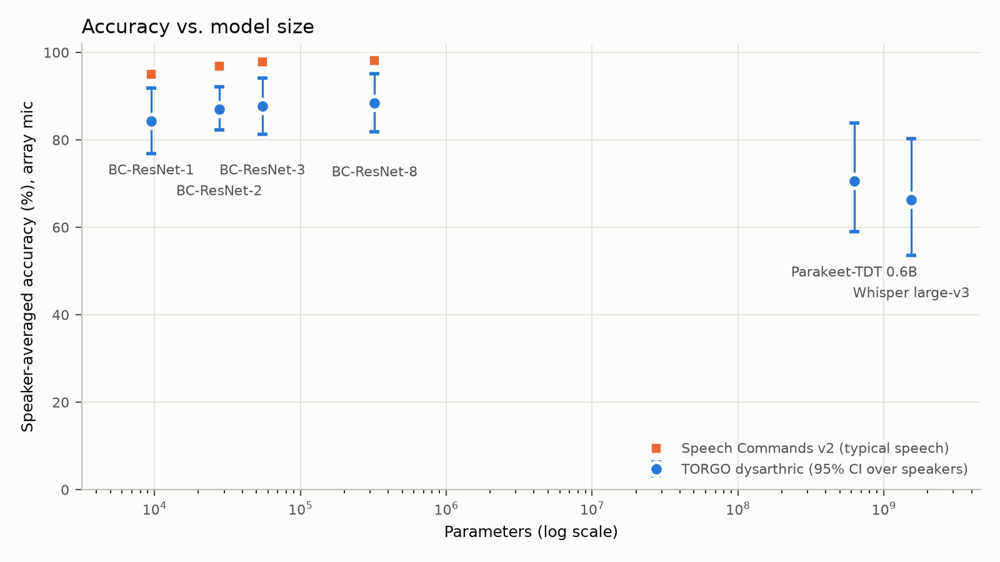
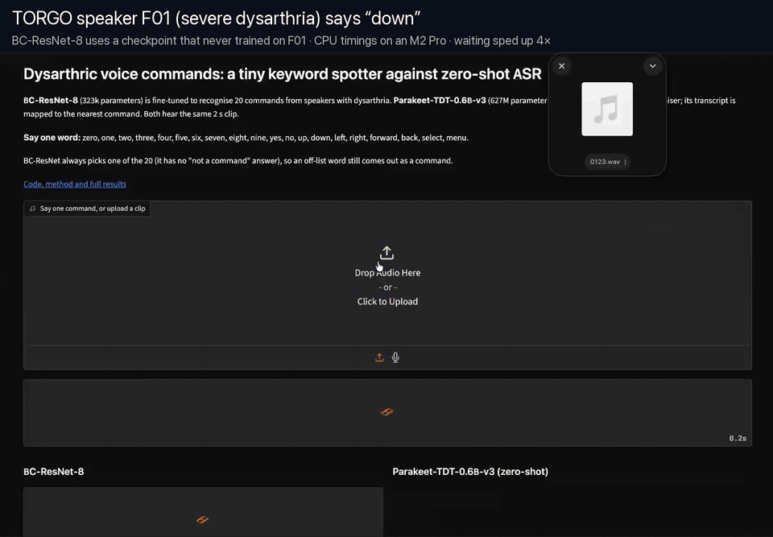
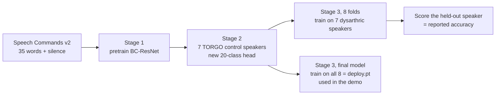

# Dysarthric Voice Command Classifier

A **323k-parameter keyword spotter** (BC-ResNet-8) recognizes 20 voice commands
from **dysarthric speakers it never trained on** with **88% accuracy**. Zero-shot
Parakeet-TDT-0.6B scores 71% and Whisper large-v3 scores 66%, and Parakeet has
**about 1,900× more parameters**. The smallest width, BC-ResNet-1, has 9.5k
parameters and still reaches 84%.



## Why

Dysarthria is a motor speech disorder, common after stroke and in cerebral palsy,
ALS and Parkinson's disease, that makes speech slurred and hard to understand. The
people who would gain most from voice control are the ones general-purpose speech
recognition serves worst: on this data, zero-shot ASR gets about 90% of commands right
for mildly dysarthric speakers but only about 55% for severe ones. This project asks whether
a tiny model, small enough for a phone or microcontroller, can do better on a fixed
set of commands.

## Results

TORGO, 8 dysarthric speakers, each held out in turn (leave-one-speaker-out). Accuracy
is computed per speaker and then averaged over speakers, on the array microphone,
with a 95% bootstrap interval over speakers. BC-ResNet numbers are seed 0; more seeds
are training.

| Model | Params | MACs / 2 s | Accuracy | 95% CI | Severe (4 speakers) | Mild (3 speakers) |
|---|---|---|---|---|---|---|
| Whisper large-v3 (zero-shot) | 1.54B | 1.3T | 66.3% | [53.6, 80.2] | 54.1% | 89.7% |
| Parakeet-TDT-0.6B-v3 (zero-shot) | 627M | 16.7G | 70.6% | [59.0, 83.8] | 56.2% | 91.2% |
| BC-ResNet-1 | 9.5k | 4.9M | 84.2% | [76.9, 91.8] | 80.3% | 91.7% |
| BC-ResNet-2 | 27.8k | 14.6M | 87.1% | [82.3, 92.2] | 82.2% | 92.9% |
| BC-ResNet-3 | 54.9k | 28.9M | 87.7% | [81.2, 94.2] | 84.3% | 91.9% |
| **BC-ResNet-8** | **323k** | **171M** | **88.4%** | [81.9, 95.1] | 81.2% | 94.1% |

- **Speaker by speaker**, BC-ResNet-8 beats Parakeet on 6 of 8 speakers and ties on the
  other 2 (two mild speakers at 100%). Mean gain: **+17.8 points** [+8.8, +26.9]. It
  beats Whisper on all 8 speakers (+22.1 points).
- **The gain is largest where ASR fails:** on the four severe speakers, 81% against 56%.
- **On the head-mounted microphone**, BC-ResNet-8 still leads at 92.4%, against 75.4% for
  Whisper and 53.3% for Parakeet.
- **On typical speech** (Speech Commands v2, 35 words + silence, 2 s window) the same
  models score 95.1% (BC-ResNet-1) to 98.1% (BC-ResNet-8) before TORGO fine-tuning.

The comparison is fair to the ASR models in two ways. They hear the same 2 s clip. Each
transcript is mapped to the nearest of the 20 commands ("lenient" scoring), so near
misses like "for" → "four" count as correct. Their strict scores (the transcript must be
exactly the word) are lower: 50.3% and 53.9%.

Full tables, per-speaker results and confusion matrices:
[`outputs/step3-bcresnet/`](outputs/step3-bcresnet/) (head mic in its `head-mic/`
subfolder); ASR-only report in [`outputs/step1-asr/`](outputs/step1-asr/).

### Limitations

- **Closed set.** The model always picks one of 20 words and has no "unknown" or
  "silence" class, so it cannot reject speech that is not a command. ASR can transcribe
  anything.
- **Small test set.** TORGO has 8 dysarthric speakers with 8–34 test clips each (array
  mic), so the intervals are wide.
- **One seed so far.** Seed-to-seed variation is not yet measured.
- **Cost is counted, not measured on a device.** MACs exclude the log-Mel front end,
  and Whisper's count includes the padding its encoder needs to reach 30 s. No model
  has been run on a phone or microcontroller yet.
- **The ASR models are not fine-tuned.** They show what an off-the-shelf system gives a
  dysarthric user, not how well a large model could do with adaptation.

## Demo

A Gradio app puts BC-ResNet-8 next to zero-shot Parakeet-TDT-0.6B-v3. Record or upload
one of the 20 commands; both models hear the same 2 s window, and the page shows each
answer with the model's size and its CPU latency.



*TORGO speaker F01 (severe dysarthria) says "down". BC-ResNet-8 is scored with
`fold1_F01.pt`, which never trained on F01. Timings on an M2 Pro CPU; the wait is sped
up 4×. One selected example: the Results table above is the evidence.*

```bash
python app.py              # BC-ResNet-8 (runs/bcresnet-8/seed0/deploy.pt) + Parakeet
python app.py --no-asr     # BC-ResNet only; starts in seconds
```

The demo contains no TORGO audio: TORGO's license covers academic use, not
redistribution. `deploy.pt` has trained on every TORGO dysarthric clip, so to score a
TORGO clip (for example in a screen recording), load the fold checkpoint that held its
speaker out:

```bash
python app.py --checkpoint runs/bcresnet-8/seed0/fold1_F01.pt   # then upload an F01 clip
```

Folds: `fold1_F01`, `fold2_F03`, `fold3_F04`, `fold4_M01`, `fold5_M02`, `fold6_M03`,
`fold7_M04`, `fold8_M05`.

## Method


```mermaid
flowchart LR
    SC[Speech Commands v2<br/>35 words + silence] --> S1[Stage 1<br/>pretrain BC-ResNet]
    S1 --> S2[Stage 2<br/>7 TORGO control speakers<br/>new 20-class head]
    S2 --> F[Stage 3, 8 folds<br/>train on 7 dysarthric speakers]
    F --> E[Score the held-out speaker<br/>= reported accuracy]
    S2 --> D[Stage 3, final model<br/>train on all 8 = deploy.pt<br/>used in the demo]
```

1. **Pretrain on typical speech.** BC-ResNet trains on Speech Commands v2 with the
   BC-ResNet paper's recipe (200 epochs, SGD, warmup + cosine). 17 of the 20 commands
   are Speech Commands words, with about 2,600 speakers, against about 10 dysarthric
   recordings per command in TORGO.
2. **Adapt to TORGO's recording setup** on its 7 control speakers: a new 20-class head
   is trained alone for 5 epochs, then the whole network for 40.
3. **Fine-tune on dysarthric speech, leave-one-speaker-out.** For each of the 8
   dysarthric speakers, start from stage 2 and train 30 epochs on the other 7. The
   held-out speaker is scored once: first attempt of each word, no augmentation.
   The 8 folds only measure accuracy. The model to use (`deploy.pt`) is trained the
   same way on all 8 speakers; it has no speaker left to be tested on, so the fold
   average is its accuracy estimate.
4. **Augment to match deployment.** Speed perturbation (×0.9–1.1, the best of the
   perturbations Geng et al. compared on disordered speech), a random position in the
   2 s window (the word is never cut), background noise at 5–20 dB SNR, ±6 dB gain,
   and SpecAugment on the log-Mel features.
5. **Fix everything in advance.** All hyperparameters are set before any held-out
   result is seen (`src/training/bcresnet_recipe.py`), and stages 2–3 keep their last
   epoch. There is no dysarthric development set, so nothing is selected on test data.

### How the evaluation was fixed

An earlier version of this project fine-tuned HuBERT-large and reported 87% accuracy
leave-one-speaker-out. A review of that pipeline found two leaks: every fold started
from a model that had already trained on the held-out speaker, and each fold picked
its best epoch on that speaker's test clips. The number did not measure generalization
to new speakers, so it was withdrawn and its outputs deleted.

The evaluation was rebuilt as a shared harness (`src/eval/`) that every model now goes
through:
- Every run records which speakers each fold trained on, and the harness refuses to
  load a run in which any fold trained on its own held-out speaker.
- Hyperparameters are fixed in advance, and the last epoch is kept.
- Accuracy is computed per speaker and then averaged, so speakers with more clips don't
  dominate.
- Confidence intervals are bootstrapped over speakers.
- Models are compared speaker by speaker.

The 88% above is the first trained-model result from that harness.

## Supported commands

| Category | Commands |
|----------|----------|
| **Digits** | zero, one, two, three, four, five, six, seven, eight, nine |
| **Actions** | yes, no, up, down, left, right, forward, back, select, menu |

## Dataset: TORGO

The [TORGO database](http://www.cs.toronto.edu/~complingweb/data/TORGO/torgo.html)
holds speech from speakers with dysarthria (cerebral palsy or ALS) and matched controls.

- **8 dysarthric speakers:** severe F01, M01, M02, M04; moderate-to-severe M05; mild
  F03, F04, M03.
- **7 control speakers:** FC01–FC03, MC01–MC04 (stage 2 training only).
- **Two microphones:** an array microphone (`wav_arrayMic`, the headline results) and a
  head-mounted one (`wav_headMic`, reported separately).

## Reproducing

### Setup

Developed with Python 3.12.

```bash
git clone https://github.com/FYC23/dysarthric-voice-command-classifier.git
cd dysarthric-voice-command-classifier
python3.12 -m venv .venv
source .venv/bin/activate
pip install -r requirements.txt       # requirements-dev.txt adds pytest
bash scripts/download_torgo.sh        # into data/raw/TORGO/, see data/README.md
bash scripts/download_speech_commands.sh
```

Run the tests with `python -m pytest tests`. TORGO augmentation needs the noise
recordings in `data/raw/speech_commands_v2/train/_silence_/`, which the Speech Commands
download provides.

### Step 1: zero-shot ASR baselines

```bash
python scripts/run_asr_baseline.py --model whisper-large-v3      # transcribe + score (resumable)
python scripts/run_asr_baseline.py --model parakeet-tdt-0.6b-v3
python scripts/report_asr_baselines.py                           # outputs/step1-asr/
```

### Step 2: BC-ResNet

Three stages per width τ ∈ {1, 2, 3, 8} and seed. The first run caches the extracted
Speech Commands words in `data/cache/speech_commands_words/`.

```bash
python scripts/pretrain_bcresnet.py --tau 8 --seed 0            # stage 1 (add --resume to continue)
python scripts/finetune_bcresnet.py --tau 8 --seed 0            # stages 2-3
```

Or train every width and seed in one go (one GPU; safe to re-run, it skips finished
steps and resumes pretraining; `DRY_RUN=1` prints the plan). It takes hours, so run it
inside `tmux` or with `nohup`:

```bash
bash scripts/train_bcresnet_all.sh                               # TAUS="1 2 3 8" SEEDS="0 1 2"
TAUS="8" SEEDS="0" DEVICE=cuda:0 bash scripts/train_bcresnet_all.sh
```

Outputs go to `runs/bcresnet-<τ>/seed<k>/`: the stage checkpoints (`pretrain.pt`,
`controls.pt`, `fold<i>_<speaker>.pt`, `deploy.pt`) and the eval-harness run in `eval/`.
Parameter and MAC counts are in `runs/bcresnet-<τ>/cost.json`.

### Step 3: combined report

```bash
python scripts/report_results.py                # every finished seed; --seeds 0 1 to pin them
```

Writes the tables, speaker-by-speaker comparisons and figures to
`outputs/step3-bcresnet/`.

### Pretrained speech models

A HuBERT / DistilHuBERT classifier with the same TORGO stages is implemented as an
accuracy reference but not yet trained. See [docs/ssl-backbones.md](docs/ssl-backbones.md).

## Project structure

```
dysarthric-voice-command-classifier/
├── src/
│   ├── config.py              # Paths, target commands, audio window
│   ├── audio.py               # Silence trimming and the fixed 2 s window
│   ├── data/                  # TORGO / Speech Commands loading and augmentation
│   ├── model/
│   │   ├── bcresnet.py        # BC-ResNet
│   │   ├── frontend.py        # log-Mel features and SpecAugment
│   │   ├── backbones.py       # Pretrained speech backbones (SSL reference)
│   │   └── architecture.py    # Weighted-sum + attention-pooling head (SSL reference)
│   ├── training/              # Recipes and loops, leave-one-speaker-out helpers
│   ├── eval/                  # Evaluation harness, reports and plots
│   ├── baselines/asr/         # Whisper / Parakeet zero-shot baselines
│   └── demo/                  # Demo model code: audio input, keyword spotter, handler
├── app.py                     # Gradio demo
├── scripts/                   # Download, train, baseline and report entry points
├── docs/                      # SSL reference model and the demo GIF
├── data/                      # Gitignored except README and labels: datasets and caches
├── runs/                      # Gitignored: checkpoints and eval runs
├── outputs/                   # Results tables and figures
└── tests/
```

## Acknowledgments

### Data

> Rudzicz, F., Namasivayam, A.K., Wolff, T. (2012) The TORGO database of acoustic and articulatory speech from speakers with dysarthria. *Language Resources and Evaluation*, 46(4), pages 523-541.

> Warden, P. (2018) Speech Commands: A Dataset for Limited-Vocabulary Speech Recognition. [arXiv:1804.03209](https://arxiv.org/abs/1804.03209)

### Models

> Kim, B., Chang, S., Lee, J., Sung, D. (2021) Broadcasted Residual Learning for Efficient Keyword Spotting. Interspeech 2021. [arXiv:2106.04140](https://arxiv.org/abs/2106.04140)

> Radford, A., Kim, J.W., Xu, T., Brockman, G., McLeavey, C., Sutskever, I. (2023) Robust Speech Recognition via Large-Scale Weak Supervision. ICML 2023. [arXiv:2212.04356](https://arxiv.org/abs/2212.04356)

> Sekoyan, M., Koluguri, N.R., Tadevosyan, N., Zelasko, P., Bartley, T., Karpov, N., Balam, J., Ginsburg, B. (2025) Canary-1B-v2 & Parakeet-TDT-0.6B-v3: Efficient and High-Performance Models for Multilingual ASR and AST. [arXiv:2509.14128](https://arxiv.org/abs/2509.14128)

> Hsu, W.N., Bolte, B., Tsai, Y.H.H., Lakhotia, K., Salakhutdinov, R., Mohamed, A. (2021) HuBERT: Self-Supervised Speech Representation Learning by Masked Prediction of Hidden Units. [arXiv:2106.07447](https://arxiv.org/abs/2106.07447)

> Chang, H.J., Yang, S.W., Lee, H.Y. (2022) DistilHuBERT: Speech Representation Learning by Layer-wise Distillation of Hidden-unit BERT. ICASSP 2022. [arXiv:2110.01900](https://arxiv.org/abs/2110.01900)

### Methods

> Yang, S.W. et al. (2021) SUPERB: Speech processing Universal PERformance Benchmark. Interspeech 2021. [arXiv:2105.01051](https://arxiv.org/abs/2105.01051)

> Geng, M., Xie, X., Liu, S., Yu, J., Hu, S., Liu, X., Meng, H. (2020) Investigation of Data Augmentation Techniques for Disordered Speech Recognition. Interspeech 2020. [arXiv:2201.05562](https://arxiv.org/abs/2201.05562)

> Park, D.S., Chan, W., Zhang, Y., Chiu, C.C., Zoph, B., Cubuk, E.D., Le, Q.V. (2019) SpecAugment: A Simple Data Augmentation Method for Automatic Speech Recognition. Interspeech 2019. [arXiv:1904.08779](https://arxiv.org/abs/1904.08779)

## License

This project is licensed under the MIT License.
