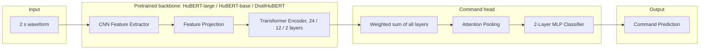

# Dysarthric Voice Command Classifier

A deep learning system for recognizing voice commands from speakers with dysarthria, trained and evaluated on the TORGO dataset: pretrained self-supervised speech models (HuBERT-large, HuBERT-base, DistilHuBERT) as the accuracy reference, and a small BC-ResNet keyword spotter for on-device use.

## Overview

Dysarthria is a motor speech disorder that affects the muscles used for speaking, making speech difficult to understand. This project provides an accessible voice command interface specifically designed for individuals with dysarthric speech patterns.

**Key Features:**
- 20 voice commands (10 digits + 10 directional/action commands)
- Pretrained speech backbones (HuBERT-large, HuBERT-base, DistilHuBERT) with a learned weighted sum of layers and attention pooling
- Staged training: TORGO control speakers first, then dysarthric speakers, evaluated leave-one-speaker-out
- Comprehensive audio augmentation pipeline

## Architecture


```mermaid
flowchart LR
    subgraph input [Input]
        Audio[2 s waveform]
    end
    subgraph backbone [Pretrained backbone: HuBERT-large / HuBERT-base / DistilHuBERT]
        FE[CNN Feature Extractor]
        FP[Feature Projection]
        Enc[Transformer Encoder, 24 / 12 / 2 layers]
    end
    subgraph head [Command head]
        WS[Weighted sum of all layers]
        AP[Attention Pooling]
        MLP[2-Layer MLP Classifier]
    end
    subgraph output [Output]
        Pred[Command Prediction]
    end
    Audio --> FE --> FP --> Enc --> WS --> AP --> MLP --> Pred
```

The model uses:
- A **pretrained self-supervised backbone**: HuBERT-large (315M parameters), HuBERT-base (95M) or DistilHuBERT (24M)
- A **learned weighted sum** of every layer's output, so the head can use the middle layers, not only the last
- **Attention pooling** to learn which audio frames matter most
- A **2-layer MLP classifier** with GELU activation and dropout

## Development Journey

This project evolved through iterative improvements:

**Initial Attempt (~20% accuracy)**
- HuBERT-large with linear classifier
- Mean pooling over time dimension
- No data augmentation
- All 46 classes (digits + commands + radio alphabet)

**Key Improvements**
1. Replaced mean pooling with **attention pooling** — learns which frames matter most
2. Changed linear classifier to **2-layer MLP** with GELU activation and dropout
3. Added comprehensive **data augmentation** pipeline (noise, pitch shift, time stretch, gain, SpecAugment)
4. Implemented **curriculum learning** (control speakers → dysarthric speakers)

**Scaling Strategy**
- First validated approach with 10 digit classes (zero-nine)
- Once successful, expanded to 20 classes (10 digits + 10 directional/action commands)
- Architecture supports scaling to full 46 classes if needed

## Project Structure

```
dysarthric-voice-cmds/
├── src/
│   ├── config.py              # Paths, target commands, audio window
│   ├── audio.py               # Silence trimming and the fixed 2 s window
│   ├── data/                  # TORGO / Speech Commands loading and augmentation
│   ├── model/
│   │   ├── backbones.py       # Pretrained speech backbones and how they load
│   │   ├── architecture.py    # Weighted-sum + attention-pooling command classifier
│   │   └── bcresnet.py        # BC-ResNet
│   ├── training/              # Recipes and loops (SSL backbones, BC-ResNet), LOSO helpers
│   ├── eval/                  # Evaluation harness
│   └── baselines/asr/         # Whisper / Parakeet zero-shot baselines
├── scripts/
│   ├── finetune_ssl.py        # Pretrained speech models (step 2)
│   ├── train_ssl_all.sh       # ...every backbone and seed
│   ├── pretrain_bcresnet.py   # BC-ResNet stage 1
│   └── finetune_bcresnet.py   # BC-ResNet stages 2-3
├── data/                      # Gitignored except README: datasets and caches
│   ├── raw/TORGO/             # TORGO as downloaded
│   └── cache/pretrained/      # Cached pretrained weights
├── runs/                      # Gitignored: training checkpoints and eval runs
├── outputs/                   # Results tables and plots
└── requirements.txt           # Python dependencies
```

## Installation

### 1. Clone the repository

```bash
git clone <repository-url>
cd dysarthric-voice-cmds
```

### 2. Install dependencies

```bash
pip install -r requirements.txt
```

For development (adds pytest), install `requirements-dev.txt` instead and run the tests with `python -m pytest tests`.

**Requirements:**
- torch, torchaudio
- transformers
- librosa
- scikit-learn
- pandas, matplotlib, seaborn

### 3. Download the TORGO dataset

```bash
bash scripts/download_torgo.sh
```

This fetches the four archives from the [TORGO Database](http://www.cs.toronto.edu/~complingweb/data/TORGO/torgo.html) and extracts them into `data/raw/TORGO/`. See [data/README.md](data/README.md) for the layout.

### 4. Pretrained speech models

`scripts/finetune_ssl.py` downloads its backbone from Hugging Face on first use and caches it in `data/cache/pretrained/`:

| Backbone | Checkpoint | Params | Layers |
|---|---|---|---|
| `hubert-large` | `facebook/hubert-large-ll60k` | 315M | 24 |
| `hubert-base` | `facebook/hubert-base-ls960` | 95M | 12 |
| `distilhubert` | `ntu-spml/distilhubert` | 24M | 2 |

If the machine cannot reach huggingface.co, use a mirror: `export HF_ENDPOINT=https://hf-mirror.com`.

## Pretrained speech models (step 2)

One run per backbone and seed: the TORGO control stage, a controls-only
evaluation, then the dysarthric fine-tune once per held-out speaker.

```bash
python scripts/finetune_ssl.py --backbone hubert-large --seed 0
python scripts/finetune_ssl.py --backbone distilhubert --seed 0 --smoke   # 1 epoch per stage, under runs/smoke/
bash scripts/train_ssl_all.sh                   # every backbone x seeds 0-2; skips finished seeds
BACKBONES="hubert-base" SEEDS="0" DEVICE=cuda:0 bash scripts/train_ssl_all.sh
```

Outputs, per backbone `<b>` and seed `<k>`:
- `runs/<b>/seed<k>/controls.pt`: after the control stage; every fold starts here
- `runs/<b>/seed<k>/fold<i>_<speaker>.pt`: never trained on `<speaker>`
- `runs/<b>/seed<k>/eval/`: the LOSO predictions for the eval harness (`src.eval.io.load_run`)
- `runs/<b>-controls/seed<k>/eval/`: the control-stage model scored on all 8 dysarthric speakers
- `runs/<b>/cost.json`, `runs/<b>-controls/cost.json`: parameters and MACs for one 2 s window

Every checkpoint is a full state dict, so one seed writes 9 of them: about 0.9 GB for
`distilhubert`, 3.4 GB for `hubert-base` and 11.4 GB for `hubert-large` (about 47 GB for
all three backbones x 3 seeds). A seed checks for that much free space before it writes anything.

A finished seed is never overwritten: delete `runs/<b>/seed<k>/` to train it again.
Runs left under `runs/hubert-large/` by the removed `scripts/train.py` (an `eval/run.json`
with no `controls.pt`) must be moved or deleted first; both scripts refuse to start over one.

## BC-ResNet (step 3)

Three stages per width τ ∈ {1, 2, 3, 8} and seed:

1. **Speech Commands pretraining**: 35 words + silence, 2 s window, the BC-ResNet
   paper's recipe (200 epochs). Needs `bash scripts/download_speech_commands.sh`.
   The first run caches the extracted words in `data/cache/speech_commands_words/`.
2. **TORGO control speakers** with a new 20-class head.
3. **TORGO dysarthric fine-tune**, once per held-out speaker (evaluated) and once on
   all 8 speakers (the deploy model).

```bash
python scripts/pretrain_bcresnet.py --tau 8 --seed 0            # stage 1 (add --resume to continue)
python scripts/finetune_bcresnet.py --tau 8 --seed 0            # stages 2-3
```

Outputs go to `runs/bcresnet-<τ>/seed<k>/`; the eval-harness run is in its `eval/`.
Stage 2–3 hyperparameters are fixed in `src/training/bcresnet_recipe.py` and are
never tuned on held-out results.

## Supported Commands

| Category | Commands |
|----------|----------|
| **Digits** | zero, one, two, three, four, five, six, seven, eight, nine |
| **Actions** | yes, no, up, down, left, right, forward, back, select, menu |

## Training Methodology (pretrained speech models)

Every backbone uses the same recipe, fixed in `src/training/ssl_recipe.py` and never tuned on held-out results (there is no development set: the held-out speaker is the only unseen data).

| Stage | Data | Epochs | Trainable | LR (head / encoder) |
|---|---|---|---|---|
| Control head warmup | 7 control speakers | 5 | head | 1e-4 / — |
| Control fine-tune | 7 control speakers | 10 | head + top layers | 1e-5 / 1e-6 |
| Dysarthric fine-tune (per fold) | the other 7 dysarthric speakers | 15 | head + top layers | 5e-5 / 5e-6 |

- AdamW (weight decay 0.01), gradient clipping at 1.0, batch size 8, class-balanced cross-entropy, per-step cosine learning rate, last epoch kept.
- Top layers: the top `min(4, layers)` transformer layers (4 of 24, 4 of 12, 2 of 2). The CNN front end, feature projection and positional convolution stay frozen.
- Leave-one-speaker-out: each fold starts from the control-stage checkpoint and never sees its held-out speaker, who is scored once (both mics, first word attempt only, no augmentation).
- Inside the backbone: one 200 ms time mask per 2 s clip (`mask_time_prob=0.05`, `mask_time_length=10`, `mask_time_min_masks=1`) and no layer drop, the same for every backbone.

## Dataset: TORGO

The [TORGO database](http://www.cs.toronto.edu/~complingweb/data/TORGO/torgo.html) contains acoustic and articulatory speech data from speakers with dysarthria.

**Speakers:**
- 8 dysarthric speakers (F01, F03, F04, M01-M05)
- 7 control speakers (FC01-FC03, MC01-MC04)

**Microphone Types:**
- `wav_arrayMic`: Acoustic Magic array microphone (recommended, better quality)
- `wav_headMic`: Head-mounted microphone

## Data Augmentation

Training only, generated on the fly; validation and test audio is never
augmented.

**TORGO (pretrained speech models and BC-ResNet)**, applied to the extracted word:
- Speed perturbation, factor from {0.9, 0.95, 1.0, 1.05, 1.1}
- Random position within the 2 s window (the word is never cut)
- Background noise with probability 0.8 at 5–20 dB SNR
- Gain ±6 dB

BC-ResNet also gets SpecAugment on its log-Mel features; the pretrained speech
models already mask time spans internally. **Speech Commands (BC-ResNet)**
follows the BC-ResNet paper: ±100 ms shift and noise with probability 0.8,
SpecAugment by width.

Training needs the noise recordings in `data/raw/speech_commands_v2/train/_silence_/`
(from `scripts/download_speech_commands.sh`, or copy just those 5 files).

## Model Architecture Details

`SSLCommandClassifier` (`src/model/architecture.py`) is a pretrained backbone followed by a `CommandHead`:

1. **Weighted sum of layers**: every hidden state (25 / 13 / 3) is layer-normalised, then mixed with softmax weights learned in training (the SUPERB setup). It starts as a plain average.
2. **Attention pooling** over time: a small network scores each frame; the output is the score-weighted average.
3. **MLP classifier**: hidden → hidden/2 (GELU, dropout 0.1) → 20 commands.

The whole head is trained in every stage.

## Results

- **Evaluation method**: Leave-one-speaker-out (LOSO) cross-validation over the 8 dysarthric speakers
- **Note**: The previously reported ~87% came from an evaluation where each fold started from a model already trained on the held-out speaker and selected its best epoch on that speaker's test data, so it overstated generalization to unseen speakers. The corrected runs come from `scripts/finetune_ssl.py` (see above).

The outputs of that old evaluation have been removed from `outputs/`; its numbers should not be quoted.

### Step 1: off-the-shelf ASR (zero-shot)

Whisper large-v3 and Parakeet-TDT-0.6B-v3 transcribe each clip (the same 2 s window the classifiers see); transcripts are scored **strict** (the transcript is exactly the word) and **lenient** (mapped to the nearest of the 20 commands). Speaker-averaged accuracy over the 8 dysarthric speakers, array mic, 95% bootstrap CI over speakers:

| Model | Strict | Lenient | Control (lenient) |
|---|---|---|---|
| Whisper large-v3 | 50.3% [33.4, 69.2] | 66.3% [53.6, 80.2] | 95.7% |
| Parakeet-TDT-0.6B-v3 | 53.9% [38.8, 70.6] | 70.6% [59.0, 83.8] | 92.0% |

Mild dysarthria is handled well (80–91%); severe speakers fall to 34–56%. Parakeet v3 is multilingual and answered in another language on 17% of dysarthric clips.

```bash
python scripts/run_asr_baseline.py --model whisper-large-v3      # transcribe + score (resumable)
python scripts/run_asr_baseline.py --model parakeet-tdt-0.6b-v3
python scripts/report_asr_baselines.py                           # tables and figures
```

Report in `outputs/step1-asr/` (head mic in `outputs/step1-asr/head-mic/`): `results.md`/`.csv`, `per_speaker.csv`, `accuracy_vs_macs.png` and one `confusion_<run>.png` per run.

## API Reference

### SSLCommandClassifier

```python
from src.model.architecture import SSLCommandClassifier, set_trainable
from src.model.backbones import BACKBONES, load_backbone

model = SSLCommandClassifier(load_backbone(BACKBONES["hubert-base"]), num_labels=20)
outputs = model(input_values, labels=None, class_weights=None)  # {'logits', 'loss' if labels given}
set_trainable(model, top_n=4)  # the head and the top 4 transformer layers; everything else frozen
```

### TORGOCommandDataset

```python
from src.data.dataset import TORGOCommandDataset

dataset = TORGOCommandDataset(
    df: pd.DataFrame,          # DataFrame with file_path, label_id columns
    feature_extractor,         # Wav2Vec2FeatureExtractor
    config,                    # Config object
    max_length: int = 48000,   # 3 seconds at 16kHz
    target_sr: int = 16000,
    augment: bool = False      # Enable augmentation for training
)
```

## Acknowledgments

### TORGO Dataset

> Rudzicz, F., Namasivayam, A.K., Wolff, T. (2012) The TORGO database of acoustic and articulatory speech from speakers with dysarthria. *Language Resources and Evaluation*, 46(4), pages 523-541.

### HuBERT

> Hsu, W.N., Bolte, B., Tsai, Y.H.H., Lakhotia, K., Salakhutdinov, R., Mohamed, A. (2021) HuBERT: Self-Supervised Speech Representation Learning by Masked Prediction of Hidden Units. [arXiv:2106.07447](https://arxiv.org/abs/2106.07447)

### DistilHuBERT

> Chang, H.J., Yang, S.W., Lee, H.Y. (2022) DistilHuBERT: Speech Representation Learning by Layer-wise Distillation of Hidden-unit BERT. ICASSP 2022. [arXiv:2110.01900](https://arxiv.org/abs/2110.01900)

### SUPERB (weighted sum of layers)

> Yang, S.W. et al. (2021) SUPERB: Speech processing Universal PERformance Benchmark. Interspeech 2021. [arXiv:2105.01051](https://arxiv.org/abs/2105.01051)

## License

This project is licensed under the MIT License.
