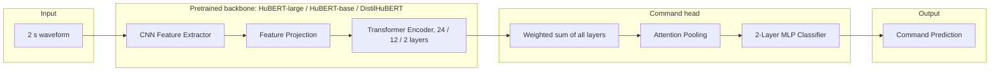

# Pretrained speech models (SSL reference)

A second model family, meant as an accuracy reference for BC-ResNet: a pretrained
self-supervised speech model (HuBERT-large, HuBERT-base or DistilHuBERT) with a small
command head, trained with the same TORGO stages and evaluated leave-one-speaker-out
through the same harness.

**Status:** trained, 3 seeds per backbone. The [README](../README.md) puts these results
next to BC-ResNet and zero-shot ASR; full tables, figures and paired comparisons are in
[`outputs/results/`](../outputs/results/).

## Results

TORGO array microphone, accuracy per speaker averaged over the 8 dysarthric speakers,
mean of 3 seeds, with a 95% bootstrap interval over speakers. "Controls only" is the
control-stage model (trained on the 7 control speakers, no dysarthric speech) scored on
all 8 dysarthric speakers. The gain is the paired per-speaker difference between the two.

| Backbone | Params | Leave-one-speaker-out | Controls only | Fine-tuning gain (pts) |
|---|---|---|---|---|
| `hubert-large` | 316M | 89.2% [85.2, 93.1] | 85.8% [81.1, 90.7] | +3.4 [+1.6, +5.4] |
| `hubert-base` | 94.8M | 81.1% [70.7, 89.9] | 74.1% [63.1, 84.5] | +7.1 [+3.3, +10.9] |
| `distilhubert` | 23.9M | 79.9% [73.5, 85.9] | 66.4% [56.6, 76.5] | +13.4 [+6.4, +21.0] |

- Dysarthric fine-tuning improves every backbone on 6 of 8 speakers and makes none
  worse (2 ties), and helps the smallest backbone most.
- HuBERT-large is the most accurate model in the project. BC-ResNet-2 (27.8k
  parameters) is 1.6 points behind it [−5.5, +2.0], better on 4 speakers and worse on 4.
- HuBERT-base and DistilHuBERT score below every BC-ResNet width.
- Head microphone: 93.4% (`hubert-large`), 88.1% (`hubert-base`), 81.4% (`distilhubert`).

Params and MACs count the whole model, CNN front end included (BC-ResNet's MACs
exclude its log-Mel front end).

## Architecture



`SSLCommandClassifier` (`src/model/architecture.py`) is a pretrained backbone followed by a `CommandHead`:

1. **Weighted sum of layers**: every hidden state (25 / 13 / 3) is layer-normalised, then mixed with softmax weights learned in training (the SUPERB setup). It starts as a plain average.
2. **Attention pooling** over time: a small network scores each frame; the output is the score-weighted average.
3. **MLP classifier**: hidden → hidden/2 (GELU, dropout 0.1) → 20 commands.

The whole head is trained in every stage.

```python
from src.model.architecture import SSLCommandClassifier, set_trainable
from src.model.backbones import BACKBONES, load_backbone

model = SSLCommandClassifier(load_backbone(BACKBONES["hubert-base"]), num_labels=20)
outputs = model(input_values, labels=None, class_weights=None)  # {'logits', 'loss' if labels given}
set_trainable(model, top_n=4)  # the head and the top 4 transformer layers; everything else frozen
```

## Backbones

`scripts/finetune_ssl.py` downloads its backbone from Hugging Face on first use and caches it in `data/cache/pretrained/`:

| Backbone | Checkpoint | Params | Layers |
|---|---|---|---|
| `hubert-large` | `facebook/hubert-large-ll60k` | 315M | 24 |
| `hubert-base` | `facebook/hubert-base-ls960` | 95M | 12 |
| `distilhubert` | `ntu-spml/distilhubert` | 24M | 2 |

If the machine cannot reach huggingface.co, use a mirror: `export HF_ENDPOINT=https://hf-mirror.com`.

## Training

Every backbone uses the same recipe, fixed in `src/training/ssl_recipe.py` and never tuned on held-out results (there is no development set: the held-out speaker is the only unseen data).

| Stage | Data | Epochs | Trainable | LR (head / encoder) |
|---|---|---|---|---|
| Control head warmup | 7 control speakers | 5 | head | 1e-4 / — |
| Control fine-tune | 7 control speakers | 10 | head + top layers | 1e-5 / 1e-6 |
| Dysarthric fine-tune (per fold) | the other 7 dysarthric speakers | 15 | head + top layers | 5e-5 / 5e-6 |

- AdamW (weight decay 0.01), gradient clipping at 1.0, batch size 8, class-balanced cross-entropy, per-step cosine learning rate, last epoch kept.
- Top layers: the top `min(4, layers)` transformer layers (4 of 24, 4 of 12, 2 of 2). The CNN front end, feature projection and positional convolution stay frozen.
- Leave-one-speaker-out: each fold starts from the control-stage checkpoint and never sees its held-out speaker, who is scored once (both mics, first word attempt only, no augmentation).
- Inside the backbone: one 200 ms time mask per 2 s clip (`mask_time_prob=0.05`, `mask_time_length=10`, `mask_time_min_masks=1`) and no layer drop, the same for every backbone. No log-Mel SpecAugment is added on top.
- TORGO waveform augmentation is the same as BC-ResNet's (see the README).

## Running it

One run per backbone and seed: the TORGO control stage, a controls-only
evaluation, then the dysarthric fine-tune once per held-out speaker.

```bash
python scripts/finetune_ssl.py --backbone hubert-large --seed 0
python scripts/finetune_ssl.py --backbone hubert-large --seed 0 --resume  # after a crash: continue that seed
python scripts/finetune_ssl.py --backbone distilhubert --seed 0 --smoke   # 1 epoch per stage, under runs/smoke/
bash scripts/train_ssl_all.sh                   # every backbone x seeds 0-2; skips finished seeds, resumes the rest
BACKBONES="hubert-base" SEEDS="0" DEVICE=cuda:0 bash scripts/train_ssl_all.sh
```

On each GPU server, first run a CUDA smoke run
(`python scripts/finetune_ssl.py --backbone distilhubert --seed 0 --smoke --device cuda`),
then start the all-script inside `tmux` or with `nohup`: `hubert-large` takes hours per seed.

Outputs, per backbone `<b>` and seed `<k>`:
- `runs/<b>/seed<k>/controls.pt`: after the control stage; every fold starts here
- `runs/<b>/seed<k>/fold<i>_<speaker>.pt`: never trained on `<speaker>`
- `runs/<b>/seed<k>/eval/`: the LOSO predictions for the eval harness (`src.eval.io.load_run`)
- `runs/<b>-controls/seed<k>/eval/`: the control-stage model scored on all 8 dysarthric speakers
- `runs/<b>/cost.json`, `runs/<b>-controls/cost.json`: parameters and MACs for one 2 s window

Every checkpoint is a full state dict, so one seed writes 9 of them: about 0.9 GB for
`distilhubert`, 3.4 GB for `hubert-base` and 11.4 GB for `hubert-large` (about 47 GB for
all three backbones x 3 seeds). A seed checks for that much free space before it writes anything
(a resumed one, only for the checkpoints it has yet to write).

A finished seed is never overwritten: delete `runs/<b>/seed<k>/` to train it again.

## Resuming

A crashed seed resumes with `--resume` (the all-script always passes it). The units are
the control stage and each fold: a unit is done once its checkpoint (`controls.pt`,
`fold<i>_<speaker>.pt`) is saved, so a crash costs at most the unit it hit. Resuming keeps
the finished units, rescoring them to rewrite both runs, and trains the rest. Every unit
seeds itself, so with the same `--num-workers` a resumed seed follows the same random
streams as an uninterrupted one: bitwise the same on the CPU, while GPU kernels may still
differ slightly (as they do between two uninterrupted runs). Checkpoints are written to a
`.tmp` file and then renamed, so a half-written one is never taken as done. Refused:
- an unfinished seed without `--resume` (pass it, or delete the seed's directory to start over);
- a kept checkpoint whose backbone, `hf_id`, seed, classes, masking, stages or training
  speakers differ from this run's (device, attention and workers may differ), or that cannot
  be read: the error names the file, which is left in place;
- a fold checkpoint not trained from the `controls.pt` beside it (each seed's `controls.pt`
  gets a random `run_id` that its folds copy), and fold checkpoints with no `controls.pt`.

Runs left under `runs/hubert-large/` by the removed `scripts/train.py` (an `eval/run.json`
with no `controls.pt`) must be moved or deleted first; both scripts refuse to start over one.
